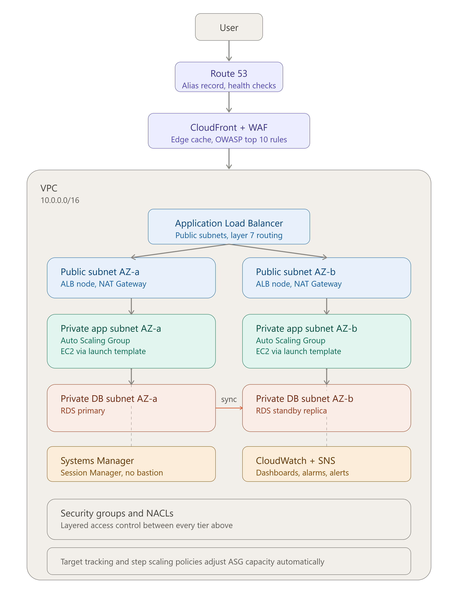

#  Scalable Web Application with ALB and Auto Scaling

A production-grade, highly available web application architecture on AWS, built with EC2 instances behind an Application Load Balancer, Auto Scaling Group, and CloudFront — backed by a Multi-AZ RDS database.



---

##  Overview

This project deploys a resilient, scalable, and secure web application on AWS using a classic EC2-based architecture. Traffic is accelerated and protected at the edge with **CloudFront** and **AWS WAF**, routed through an **Application Load Balancer**, and served by an **Auto Scaling Group** of EC2 instances spread across two Availability Zones. Data is persisted in a **Multi-AZ RDS** instance with automated failover, and the entire environment is monitored, secured, and managed without exposing any bastion hosts.

### Goals

-  High availability across two Availability Zones
-  Automatic scaling based on real-time demand
-  Defense in depth (WAF, Security Groups, NACLs, private subnets)
-  Zero public exposure for compute and database tiers
-  Full observability with dashboards, alarms, and notifications
-  Secure operational access without SSH/bastion hosts

---

##  Architecture

**Request flow:**

```
User
 │
 ▼
Route 53 (Alias record + health checks)
 │
 ▼
CloudFront (caches static & dynamic content)  ──▶  AWS WAF (Layer 7 rules, OWASP Top 10)
 │
 ▼
VPC
 │
 ▼
Application Load Balancer (public subnets, both AZs)
 │
 ├──▶ Availability Zone A                    ├──▶ Availability Zone B
 │     ├─ Public subnet   → NAT Gateway      │     ├─ Public subnet   → NAT Gateway
 │     ├─ Private app subnet → ASG (EC2)     │     ├─ Private app subnet → ASG (EC2)
 │     └─ Private DB subnet  → RDS Primary   │     └─ Private DB subnet  → RDS Standby (sync)
 │
 ▼
CloudWatch + SNS (dashboards, alarms, alerts)
Systems Manager (Session Manager — no bastion)
Security Groups + NACLs (layered access control across every tier)
```

### Components

| Layer | Service | Purpose |
|---|---|---|
| DNS | **Route 53** | Alias record pointing to the ALB, with health checks for failover |
| Edge / CDN | **CloudFront** | Caches static & dynamic content to reduce latency |
| Edge Security | **AWS WAF** | Layer 7 protection against the OWASP Top 10 |
| Networking | **VPC** | Public & private subnets across 2 AZs, NAT Gateways, Security Groups, NACLs |
| Load Balancing | **Application Load Balancer** | Layer 7 routing across AZs |
| Compute | **EC2 + Auto Scaling Group** | Launch Template–based instances with target tracking scaling policies |
| Database | **RDS (Multi-AZ)** | MySQL/PostgreSQL with a primary + synced standby and automated failover |
| Access | **Systems Manager (Session Manager)** | Secure shell access to instances without a bastion host or open SSH ports |
| Observability | **CloudWatch + SNS** | Metrics, dashboards, alarms, and notifications |

---

##  Security Design

- **No public compute or database access** — EC2 instances and RDS live exclusively in private subnets.
- **Layered access control** — Security Groups (stateful, resource-level) combined with NACLs (stateless, subnet-level) enforce least-privilege traffic between every tier.
- **No bastion hosts** — all administrative access to EC2 instances goes through AWS Systems Manager Session Manager, removing the need for open inbound SSH.
- **Edge protection** — AWS WAF filters malicious Layer 7 traffic (SQLi, XSS, etc.) before it ever reaches the ALB.
- **Outbound internet access** for private instances (patching, package installs) is routed through NAT Gateways in each AZ, never inbound.

---

##  Scalability & High Availability

- The **Auto Scaling Group** spans both Availability Zones and uses a **Launch Template** to guarantee consistent instance configuration.
- **Target tracking scaling policies** automatically add or remove EC2 capacity based on metrics such as average CPU utilization or request count per target.
- The **Application Load Balancer** distributes incoming traffic evenly across healthy instances in both AZs.
- **RDS Multi-AZ** maintains a synchronously replicated standby instance in the second AZ and performs automatic failover if the primary becomes unavailable.
- **CloudFront** offloads repeated static/dynamic content requests from the origin, improving latency and reducing backend load.

---

##  Monitoring & Alerting

- **CloudWatch dashboards** provide visibility into ALB request metrics, ASG instance health/count, RDS performance, and NAT Gateway throughput.
- **CloudWatch Alarms** trigger on thresholds such as high CPU, unhealthy target count, or database failover events.
- **SNS topics** notify the operations team (via email/SMS/Slack integration) whenever an alarm fires.

---

##  Prerequisites

- An AWS account with sufficient permissions to create VPCs, EC2, RDS, ALB, CloudFront, WAF, Route 53, and IAM resources
- [AWS CLI](https://aws.amazon.com/cli/) configured with valid credentials
- (Optional) [Terraform](https://www.terraform.io/) or AWS CloudFormation if deploying via Infrastructure as Code
- A registered domain name in Route 53 (or a hosted zone you control) if using the Route 53 alias record

---

##  Deployment Steps (High-Level)

1. **Networking** — Create the VPC with public and private subnets across two AZs; deploy NAT Gateways, an Internet Gateway, route tables, Security Groups, and NACLs.
2. **Database** — Launch a Multi-AZ RDS instance (MySQL/PostgreSQL) inside the private DB subnets.
3. **Compute** — Create a Launch Template defining the EC2 AMI, instance type, IAM role (with SSM permissions), and user-data bootstrap script; deploy an Auto Scaling Group across the private app subnets.
4. **Load Balancing** — Provision an Application Load Balancer in the public subnets, configure target groups and health checks, and attach the ASG.
5. **Edge & Security** — Attach an AWS WAF Web ACL (OWASP Top 10 managed rule sets) to the ALB or CloudFront distribution; create a CloudFront distribution pointing to the ALB as its origin.
6. **DNS** — Create a Route 53 Alias record pointing to the CloudFront distribution (or ALB), with health checks enabled.
7. **Operations** — Enable Systems Manager on all EC2 instances (via IAM instance profile) for Session Manager access.
8. **Monitoring** — Set up CloudWatch dashboards and alarms (CPU, target health, RDS failover, NAT throughput) and connect them to an SNS topic for alerting.

>  This repository can be extended with Terraform modules or CloudFormation templates under an `infra/` directory to fully automate the steps above.

---

##  Suggested Repository Structure

```
.
├── README.md
├── architecture-diagram.png
├── infra/                  # Terraform / CloudFormation IaC (optional)
│   ├── vpc/
│   ├── ec2-asg/
│   ├── alb-waf/
│   ├── rds/
│   ├── cloudfront/
│   └── route53/
├── scripts/                 # User-data / bootstrap scripts for EC2
└── docs/                     # Additional architecture notes, runbooks
```

---

##  Key AWS Services Used

- **VPC** — Public & private subnets, NAT Gateway, Security Groups, NACLs
- **EC2 + ASG** — Launch Template, target tracking scaling policies
- **ALB + WAF** — Layer 7 routing, WAF rules for OWASP Top 10
- **CloudFront** — Static/dynamic content caching, reduced latency
- **RDS Multi-AZ** — MySQL/PostgreSQL with automated failover
- **Route 53** — Alias record to ALB/CloudFront, health checks
- **Systems Manager** — Session Manager for secure, bastion-free instance access
- **CloudWatch + SNS** — Dashboards, alarms, and notifications

---

##  License

This project is provided as an architecture reference. Add your preferred license (e.g., MIT) here.

---
